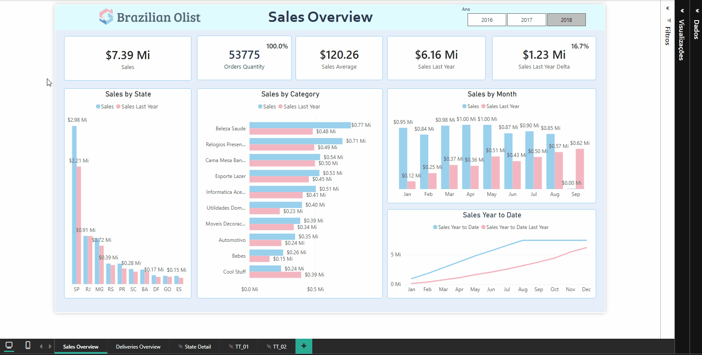
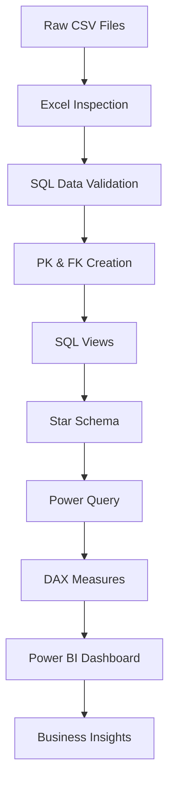
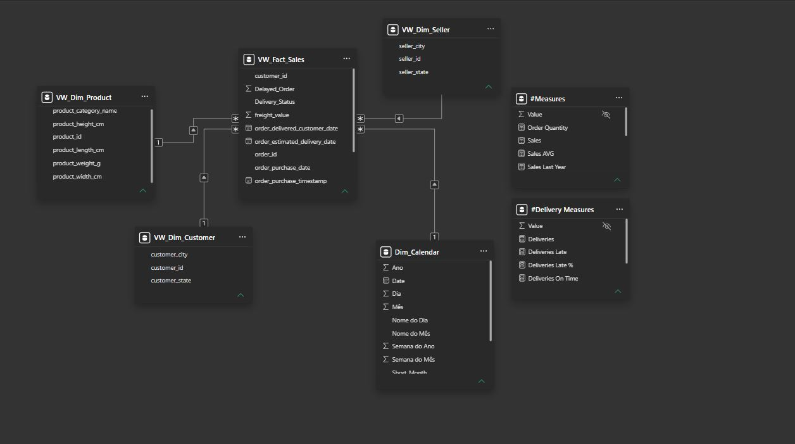
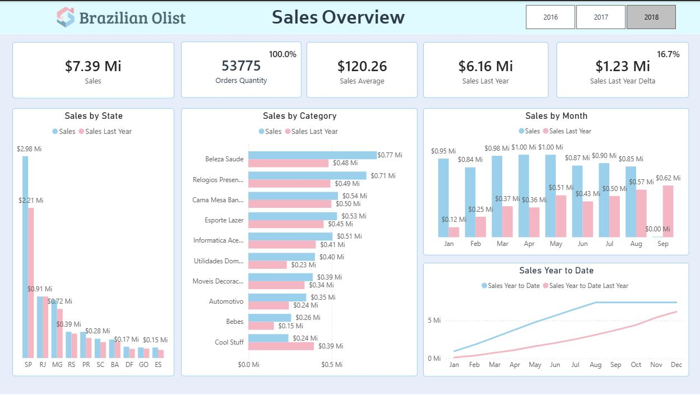
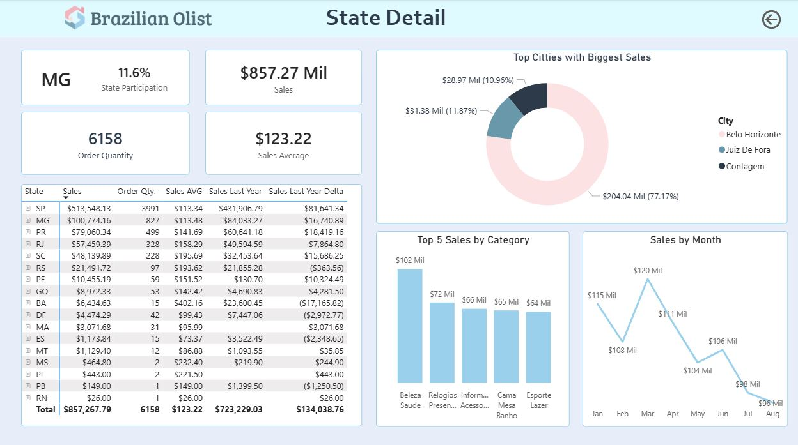
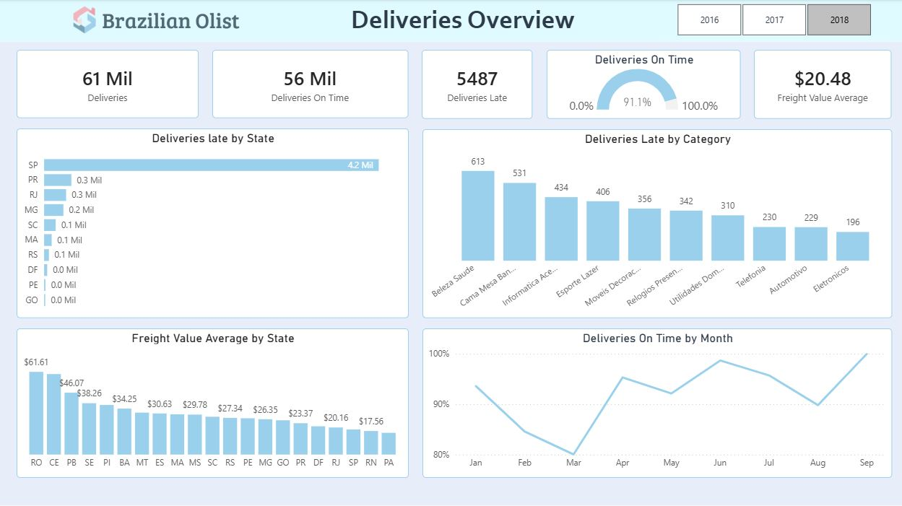

# Brazilian E-Commerce Sales & Logistics Analysis

## Project Overview

This project analyzes sales performance and logistics operations using the Brazilian E-Commerce Public Dataset by Olist.

The objective was to transform raw transactional data into an analytical model capable of answering key business questions related to revenue, product performance and delivery efficiency.

To achieve this, the project included data validation and modeling in SQL, data transformation with Power Query, creation of business metrics using DAX, and development of an interactive Power BI dashboard.

The final solution enables users to monitor sales trends, identify top-performing regions and product categories, evaluate logistics performance and support data-driven decision making.

## Business Problem

Questions answered by the analysis:
-	Which states generate the highest revenue?
-	Which product categories contribute most to sales?
- Which months have the highest revenues?
- How much more was sold compared to the same month of the previous year?
-	How has revenue evolved over time?
-	How efficient is the delivery operation?
- What is the average shipping cost to the states?
-	Which states have the highest delivery delay rates?

## Project Workflow

## Dataset
###	Brazilian E-Commerce Public Dataset by Olist

This project uses the Brazilian E-Commerce Public Dataset by Olist, which contains approximately 100,000 orders placed between 2016 and 2018.

The dataset includes transactional information about:

- Customers
- Orders
- Products
- Sellers
- Payments
- Reviews
- Geolocation
- Deliveries

**Available at:** https://www.kaggle.com/datasets/olistbr/brazilian-ecommerce

(Files can also be downloaded from the dataset folder here.)

-	Main data for analysis: Customers, Orders, Products, Sellers, Payments and Deliveries

-	Tables analyzed:
    - olist_customers_dataset.csv
    - olist_geolocation_dataset.csv
    - olist_order_items_dataset.csv
    - olist_order_payments_dataset.csv
    - olist_order_reviews_dataset.csv
    - olist_orders_dataset.csv
    - olist_products_dataset.csv
    - olist_sellers_dataset.csv

## SQL Data Preparation

SQL was used to validate data quality, model the relational database and prepare analytical structures for Power BI.

### Data Validation

The following validation steps were performed:

- Checked duplicate records
- Identified missing values
- Validated purchase and delivery dates
- Verified revenue consistency
- Validated referential integrity between tables

### SQL Views

To simplify data consumption in Power BI and improve maintainability, analytical SQL Views were created.

- VW_Fact_Sales
- VW_Dim_Customer
- VW_Dim_Product
- VW_Dim_Seller

## Dimensional Modeling
Star Schema designed for analytical reporting.
Fact Table:
-	Fact_Sales
    - order_id
    - customer_id
    - product_id
    - seller_id
    - order_purchase_timestamp
    - olist_order_items_dataset
    - order_delivered_customer_date
    - order_estimated_delivery_date
    - price
    - freight_value
    - Delivery_Status
    - Delayed_Order
    
Dimension Tables:
-	Dim_Customer
    - customer_city
    - customer_id
    - customer_state
    
-	Dim_Product
    - product_id
    - product_category_name
    - product_weight_g
    - product_length_cm
    - product_height_cm
    - product_width_cm
    
-	Dim_Seller
    - seller_id
    - seller_city
    - seller_state
    
-	Dim_Calendar
    - Date
    - Year
    - Month
    - Month Day
    - Quarter(Number)
    - Week of the Year
    - Week of the Month
    - Day
    - Name of the Day
    - Short_Month
    - YearMonth
    - YearMonth_desc
    

## Power Query Transformations
The following transformations were applied before loading the model:

- Corrected data types
- Standardized product categories
- Renamed columns
- Treated date fields
- Created calculated columns

## Calendar Table
Custom calendar table created to support Time Intelligence calculations.
Features:
- Date
- Year
- Month
- Month Day
- Quarter(Number)
- Week of the Year
- Week of the Month
- Day
- Name of the Day
- Short_Month
- YearMonth
- YearMonth_desc

## DAX Measures

Business KPIs were developed using DAX, including:

### Revenue

- Sales
- Sales AVG
- Sales YTD
- Sales Last Year
- Sales Delta (%)

### Orders

- Order Quantity
- Average Freight

### Logistics

- Deliveries
- On-Time Deliveries
- Late Deliveries
- Delivery Delay Rate

## Dashboards

The dashboard was designed to provide an interactive overview of sales performance and logistics indicators.
It contains three analytical pages:

### 01 - Sales Overview:

Main KPIs:
-	Sales
-	Orders
-	Average Ticket
-	Sales by State
-	Sales by Category

### 02 - State Detail (Drillthrough):

Main KPIs:
-	Sales
-	Orders
-	Top Categories
-	Top Cities
-	Revenue Comparison

### 03 - Deliveries Overview

Main KPIs:
-	Deliveries
-	On-Time Deliveries
-	Late Deliveries
-	On-Time Rate
-	Freight Average

### Design
The colors and themes used in the project were based on the logo randomly generated by an AI. 
From there, I based the entire Dashboard simulating the visual identity of a real company. The choice of minimalist design was also intentional. 
The idea was to keep the focus on the data, without masking or decorating everything in a "pretty and flashy" design, but trying to maintain good storytelling.

### All background images and color scheme can be downloaded here:
`Images/Power_BI_Design`

## Key Insights
**Sales and logistics indicators can be analyzed together, allowing the identification of regions that combine high revenue with efficient delivery performance, supporting more informed business decisions.**

### Sales Performance

- **Revenue is highly concentrated in São Paulo**, making it the company's primary commercial market and highlighting a strong geographic dependency.

- **Health & Beauty ranked among the highest-performing product categories**, making a significant contribution to overall sales.

- **Sales showed noticeable monthly fluctuations**, revealing seasonal patterns and periods of stronger commercial performance.

### Logistics Performance

- **More than 90% of deliveries were completed on time**, indicating an overall efficient logistics operation.

- **Delivery delays were concentrated in a limited number of states**, suggesting that logistical issues are localized rather than widespread.

- **Average freight costs varied considerably across both states and product categories**, reflecting differences in shipping distance, product characteristics, and regional logistics conditions.

## Skills Demonstrated

- Data Cleaning
- Data Validation
- Relational Database Modeling
- Star Schema Design
- SQL Query Development
- Data Transformation
- DAX Calculations
- KPI Development
- Dashboard Design
- Business Analysis
- Data Storytelling

## Technologies Used
-    Excel
-	SQL Server
-	Power BI
-	DAX
-	Power Query
-	Git
-	GitHub

## Dashboard Link

 [Dashboard_Power_BI](https://app.powerbi.com/view?r=eyJrIjoiMTkzMTNhOWMtNWQ5Zi00OWE4LWFmNDctYWRmYTI0YmYzNmM3IiwidCI6IjY1OWNlMmI4LTA3MTQtNDE5OC04YzM4LWRjOWI2MGFhYmI1NyJ9)

-----------------------------------------------------------
## Author

Matheus Henrykssen

  <a href="https://www.linkedin.com/in/matheus-goncalves-45534a414/">
    🔗 LinkedIn
  </a>
  &nbsp; | &nbsp;
  <a href="https://github.com/matheushenrykssen">
    💻 GitHub
  </a>

